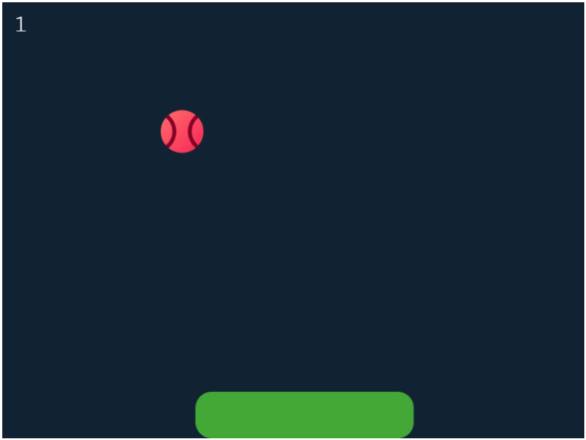

# PingPong Game

This is a simple PingPong game I built using [Phaser 3](https://phaser.io/) as a starting project into simple web-based game development.



## Table of Contents
- [Overview](#overview)
- [Features](#features)
- [Installation](#installation)
- [Usage](#usage)
- [Game Controls](#game-controls)
- [Project Structure](#project-structure)

## Overview
This is a classic Ping-Pong game in which the player controls a paddle to bounce the ball and score points. The ball's speed increases as the score increases, making the game progressively more challenging.

## Features
- The usual basic features of a PingPong game...

## Installation
1. Clone the repository:
   ```bash
   git clone https://github.com/yunethw/PingPong
   cd PingPong
   ```
2. Install dependencies:
   ```bash
   npm install
   ```
3. Start the development server:
   ```bash
   npm run dev
   ```

## Game Controls
Moving the mouse horizontally moves the paddle. 

## Project Structure
```
PingPong/
├── assets/               # Game assets (images, sounds, etc.)
├── src/
│   ├── main.js           # Entry point for the game
│   ├── scenes/
│       └── pingpong.js   # Main game scene
├── index.html            # HTML file to load the game
├── package.json          # Project dependencies and scripts
└── README.md             # Project documentation
```
